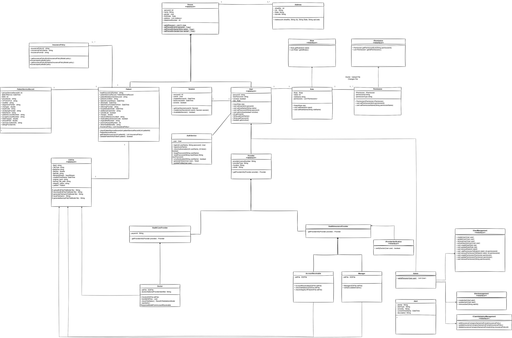

# IntegrityTool — Healthcare EDI X12 837 Platform

> End-to-end healthcare claims processing system — X12 837 parsing · CMS-1500 mapping · Role-based access control · EDI file integrity verification · Admin dashboard · Audit logging

[](https://github.com/integrity-tool/IntegrityToolBackend)
[](https://github.com/integrity-tool/IntegrityToolUI)
[](https://github.com/integrity-tool/IntegrityToolBackend)
[](https://github.com/integrity-tool/IntegrityToolUI)
[](https://github.com/integrity-tool/IntegrityToolBackend)

---

## What is IntegrityTool?

IntegrityTool is a production-grade healthcare EDI processing platform that ingests raw X12 837 EDI files, validates their integrity via hash verification, parses them into structured claim records mapped to CMS-1500 format, and exposes them through a patient-facing portal and a secure admin dashboard with full role-based access control.

**The problem it solves:** X12 837 is the standard EDI format for submitting healthcare insurance claims in the US and Canada. It is notoriously difficult to parse — cryptic 2-character segment identifiers, qualifier-driven polymorphism, and nested loop structures that vary by claim type. IntegrityTool handles all of that, adds file integrity verification, and delivers clean, auditable claim records to both patients and administrators.

---

## Repositories

| Repo | Description | Stack |
|---|---|---|
| [IntegrityToolBackend](https://github.com/integrity-tool/IntegrityToolBackend) | User API — X12 837 parsing, CMS-1500 mapping, session management, claim submission | Java · Spring Boot · PostgreSQL |
| [IntegrityToolUI](https://github.com/integrity-tool/IntegrityToolUI) | Patient portal — claim submission, status tracking, policy management | Angular · TypeScript |
| [IntegrityToolAdmin](https://github.com/integrity-tool/IntegrityToolAdmin) | Admin API — claim management, EDI file processing, RBAC, audit trail, alerts | Java · Spring Boot · PostgreSQL |
| [IntegrityToolAdminUI](https://github.com/integrity-tool/IntegrityToolAdminUI) | Admin dashboard — claim review, file uploads, analytics, user & role management | Angular · TypeScript |

---

## System architecture

```
  Patient Portal                      Admin Dashboard
  (IntegrityToolUI)                   (IntegrityToolAdminUI)
  Angular · TypeScript                Angular · TypeScript
        │                                     │
        │ REST + JWT                          │ REST + JWT
        ▼                                     ▼
┌─────────────────────┐         ┌──────────────────────────┐
│  IntegrityTool      │         │  IntegrityTool Admin      │
│  Backend            │         │  Backend                  │
│                     │         │                           │
│  • X12 837 parser   │         │  • EDI file upload        │
│  • CMS-1500 mapper  │         │  • Hash integrity check   │
│  • Claim validation │         │  • Role-based access      │
│  • Session mgmt     │         │    (Doctor / Manager /    │
│  • Insurance policy │         │     AccountsReceivable /  │
│    management       │         │     Admin)                │
│                     │         │  • Alert system           │
└──────────┬──────────┘         │  • Audit trail            │
           │                    └──────────────┬────────────┘
           │                                   │
           └──────────────┬────────────────────┘
                          │
                          ▼
              ┌───────────────────────┐
              │      PostgreSQL        │
              │                       │
              │  PERSON               │
              │  PATIENT              │
              │  INSURANCE_POLICY     │
              │  CLAIM                │
              │  PATIENT_SERVICE_RECORD│
              │  EDI_FILE             │
              │  SYSTEM_USERS         │
              │  ROLE / PERMISSION    │
              │  ALERTS               │
              │  ADDRESS              │
              └───────────────────────┘
```

---

## Database — Entity Relationship Diagram


The central entity is `PERSON`, from which `PATIENT`, `DOCTOR`, `HEALTH_CARE_PROVIDER`, and `HEALTH_INSURANCE_PROVIDER` are derived. Key relationships:

- `PERSON` → `CLAIM` via `person_claim_mapping`
- `CLAIM` → `INSURANCE_POLICY` (policy coverage per claim)
- `PERSON` → `patient_service_record` (CPT/HCPCS codes, diagnosis, procedures, charges)
- `PERSON` → `EDI_FILE` via `CONTAINS` (file ownership and integrity tracking)
- `EDI_FILE` → `file_user_mapping` (hash_before, hash_after, change tracking)
- `SYSTEM_USERS` → `ROLE` → `PERMISSION` via RBAC join tables
- `SYSTEM_USERS` → `ALERTS` (notification system)

---

## Class diagram



Key design decisions visible in the class diagram:

- **`Person` is abstract** — `Patient`, `Doctor`, `HealthCareProvider`, and `HealthInsuranceProvider` extend it, with role-specific behaviour encapsulated per subclass
- **`EDIFile` is abstract** — concrete subclasses implement `downloadEDIFile()`, `handleEDIFile()`, `generateBackupFile()`, and `generateBackupFileModel()`
- **`AuthService`** handles login, session creation, token generation, and authorization checks independently of the user hierarchy
- **`IUserManagement`, `IClaimValidationManagement`, `IAlertManagement`** are interfaces — the Admin class implements all three, keeping the admin layer clean and testable
- **`ProviderVerification` interface** — `verifyDoctor(User user): boolean` keeps provider verification decoupled from the user model
- **`Session`** entity tracks `userId`, `createdAt`, `expiresAt`, and `isActive` — explicit session management rather than stateless JWT-only

---

## Domain model highlights

### EDI file integrity verification
Every uploaded EDI file is hashed on ingestion (`hash_before`) and after any transformation (`hash_after`). The `integrity_status` field on `EDI_FILE` tracks whether the file has been tampered with — a critical requirement for healthcare audit compliance.

### Role-based access control
Four distinct user roles with permission isolation:

| Role | Access |
|---|---|
| `Doctor` | Upload EDI files, view own patient service records |
| `AccountsReceivable` | Verify located claims, manage receivables |
| `Manager` | Manage EDI files, verify located claims |
| `Admin` | Full access — user management, role assignment, permissions, alerts |

### Claims processing flow
```
EDI File Upload (Doctor)
        │
        ▼
Hash verification → integrity_status flagged if mismatch
        │
        ▼
X12 837 Parsing → PATIENT_SERVICE_RECORD created
        │          (CPT/HCPCS, diagnosis, procedures,
        │           charges, service dates, provider info)
        ▼
CMS-1500 Mapping → all 33 form boxes populated
        │
        ▼
person_claim_mapping → links CLAIM to PERSON + INSURANCE_POLICY
        │
        ▼
Alert generated → SYSTEM_USERS notified
```

---

## Tech stack

| Layer | Technology |
|---|---|
| Backend language | Java 17 |
| Backend framework | Spring Boot 3.2 |
| API documentation | SpringDoc OpenAPI (Swagger UI) |
| Authentication | JWT + Session management |
| Frontend language | TypeScript 5 |
| Frontend framework | Angular 17 |
| UI components | Angular Material |
| Database | PostgreSQL |
| Testing | JUnit 5 · Mockito · Jasmine |
| Build | Maven · Angular CLI |

---

## Getting started

```bash
git clone https://github.com/integrity-tool/IntegrityToolBackend.git
git clone https://github.com/integrity-tool/IntegrityToolUI.git
git clone https://github.com/integrity-tool/IntegrityToolAdmin.git
git clone https://github.com/integrity-tool/IntegrityToolAdminUI.git
```

See the README in each repository for individual setup instructions.

---

## Author

**Krishna Solanki** — Full-stack developer, Montreal QC

[github.com/krishnasolanki](https://github.com/krishnasolanki) · [linkedin.com/in/krishnasolanki](https://linkedin.com/in/krishnasolanki) · krishnasolanki120@gmail.com
